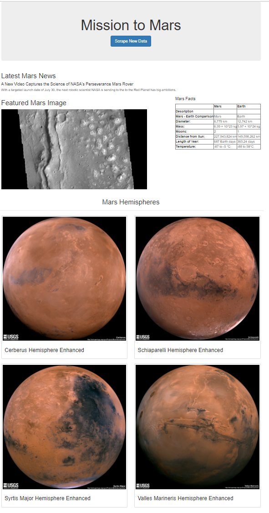

# Mission-to-Mars
## HTML Web Scraping to create a flask web application using Python and MongoDB
Create a web application with Falsk using MongoDB and Scraping images and data using BeautifulSoup

## Resources
- https://data-class-mars.s3.amazonaws.com/Mars/index.html
- https://spaceimages-mars.com
- https://galaxyfacts-mars.com
- https://marshemispheres.com/

## Result

